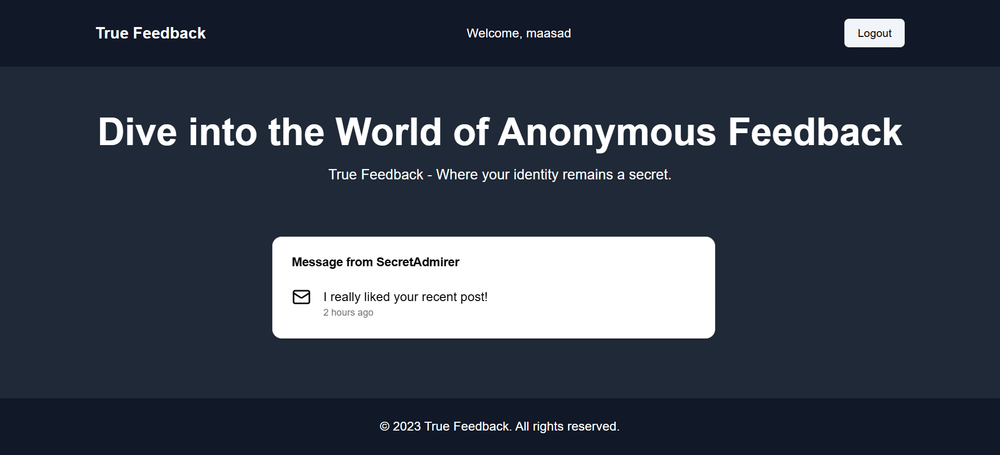

# Mystery-Feedback

Go Live: https://mystery-feedback.onrender.com 
Its a Full Stack NextJS project. 

 

<b>What i used in this project:</b>

1. Frontend & Backend By NextJS
2. Google Generative AI for suggesting message
3. Next Auth for Credential Login
4. Zod for schema validation
5. React Hook Form for form
6. ShadCN for UI componenet
7. Resend for sending OTP
8. Mongoose for connecting database

And More...